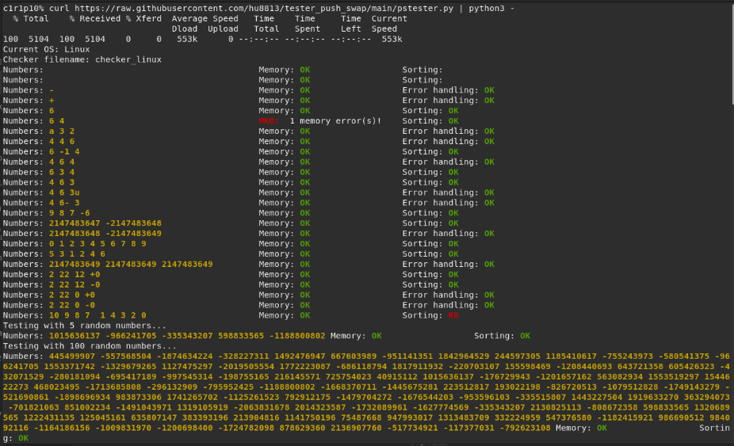

# Push Swap Tester for 42 School Project

## About
A simple Push_swap tester for testing memory leaks, errors, and error handling in the 42 school project push_swap. This Python script is designed for Linux and macOS systems.

## Usage
To use the Push Swap Tester script, follow these steps:

1. Ensure that you have the push_swap and checker programs (for Linux or macOS) in the same directory.
2. Run the following command in the terminal:

    ```sh
    curl https://raw.githubusercontent.com/hu8813/tester_push_swap/main/pstester.py | python3 -
    ```

    This command will download and execute the `pstester.py` script from the GitHub repository.

## Screenshot of a Test Result



## Topics
push-swap, pushswap, push-swap-tester, pushswap-tester, push-swap42, pushswap-42, pushswaptester, push-swap-42, tester-push-swap, pushswap42

## Keywords
push-swap, pushswap, push_swap, 42 school project, memory leak tester, error handling tester, push-swap-tester, pushswap-tester, pushswap42, pushswap-42, Linux, macOS, Python script, tester-push-swap, pushswap tester
