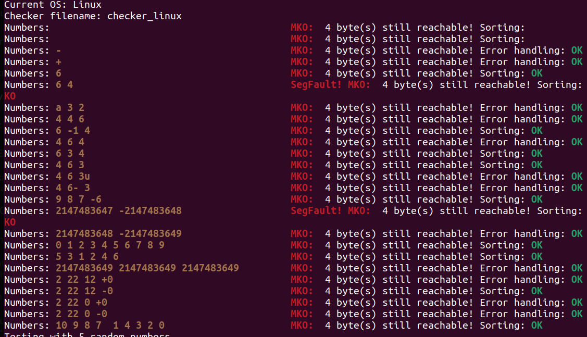

# tester_push_swap
A Python script that tests memory leaks, errors, and error handling for push_swap. 

# Usage
To use it, in the directory where your ./push_swap and checker programs are, run following command: 

```
pip install test-push-swap
```

then

```
test_push_swap
```

or

```
curl https://raw.githubusercontent.com/hu8813/tester_push_swap/main/pstester.py | python3 -
```



It works well with valgrind on Linux, but may not check memory on Mac.
